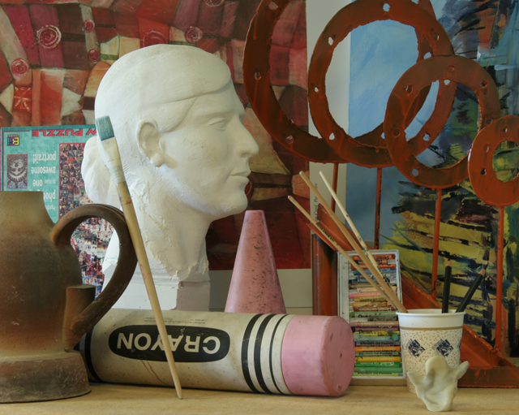
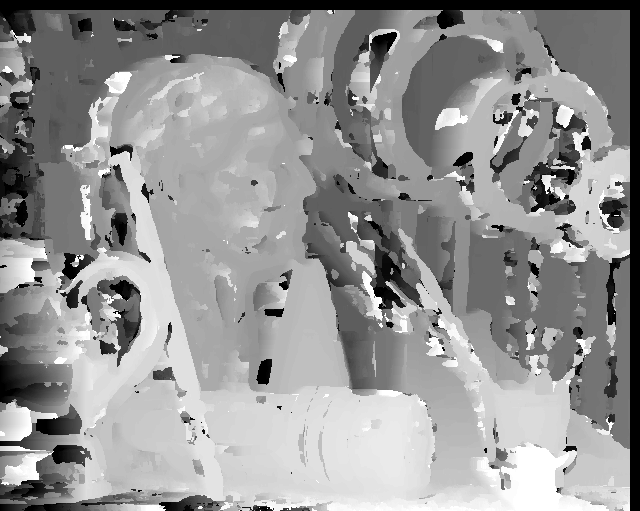

# CV-WindowBasedSteroMatching
Estimate dense stereo correspondence with window based methods

#### Original image

#### Stero matching

Implement the SSD based match algorithm that returns a disparity image
Closer objects should be brighter in the map

